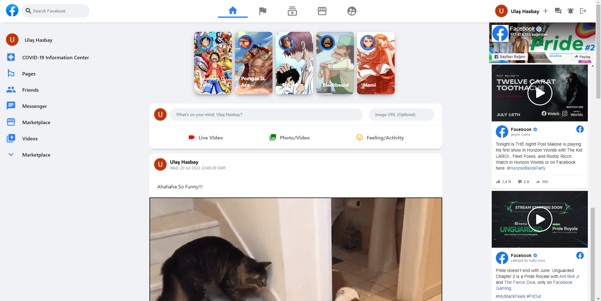

# React Facebook Clone


# Technologies

- React

- Context API

- Material UI

- Firebase

# Screenshots


# Installation
``` npm install ```

or

``` yarn add ```

#### After Installation create ``` .env ``` file and copy your firebase configs into it


```
REACT_APP_FIREBASE_API_KEY=
REACT_APP_FIREBASE_AUTH_DOMAIN=
REACT_APP_FIREBASE_PROJECT_ID=
REACT_APP_FIREBASE_STORAGE_BUCKET=
REACT_APP_FIREBASE_MESSAGING_SENDER_ID=
REACT_APP_FIREBASE_AAPP_ID=
```